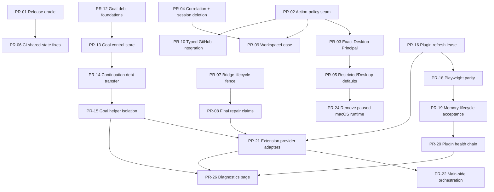

# Octo Chat remediation program — two-maintainer execution plan

**Program baseline:** 2026-09-14
**Current repository line:** Octo Chat 2.2.0, bridge protocol 14
**Finding source:** [`octo-chat-full-audit-2026-09-14.md`](octo-chat-full-audit-2026-09-14.md)
**Historical engineering reports:** [`old docs-report/`](<old docs-report/>)

This document is the working plan for turning the 2026-09-14 audit into a sequence of reviewable pull requests owned by **two continuously active maintainers using AI development workers**. It is deliberately more concrete than the audit's broad phases: it defines ownership, dependencies, merge order, concurrency, fallback work when a PR is waiting, and the evidence required before each tranche is considered complete.

The audit was performed against the pre-reset 2.1.11 / bridge-13 tree. The current public line is 2.2.0 / bridge 14. Every implementation PR therefore starts by re-reading the current owner code and reproducing or re-confirming the finding on current `main`; an audit item is not permission to blindly paste an old fix into a moved subsystem.

## 1. Program objective

The program is complete when Octo Chat has one compositional authority model, durable ownership facts do not disappear or resurrect across crashes, browser/Goal/plugin workflows have explicit final-action fences, the Windows production path is what the tests actually exercise, and the release gate is repeatably green.

The program protects the strong invariants already identified by the audit:

- the direct filesystem sandbox remains the direct-file boundary;
- command/process custody, worker WALs and browser receipts keep their existing crash barriers;
- plugin mutations are never retried after an ambiguous side effect;
- plugin schema refresh continues refusing obsolete tool declarations;
- Electron renderer isolation/CSP/navigation guards remain strict;
- update download hashing and staged-file rehashing remain intact;
- frame, accessibility-ref, helper and run generations stay explicit;
- Memory storage is not rewritten speculatively before a production lifecycle test demonstrates a fault;
- session pagination and agent-family ownership are not redesigned without a new reproduction.

The central architectural target is:

```text
exact Principal
→ Workspace/Capability Lease
→ central Action Policy
→ typed execution adapter
→ subsystem-specific safety mechanisms
```

## 2. Human ownership model

Two humans own the program. Each pull request has exactly one accountable human owner even when AI workers produce portions of the patch.

| Maintainer | Primary lane | Typical semantic owners |
| --- | --- | --- |
| **Maintainer A — Authority lane** | security policy, Desktop, workspace, GitHub integration, updater trust, platform cleanup | `config`, `capabilities`, policy/Principal/leases, Desktop registrars/native boundary, workspace, updater/release security |
| **Maintainer B — Reliability lane** | CI oracle, durable identity/session state, bridge/repairs, Goal, plugins, extension/provider adapters | correlation/session store, bridge lifecycle, Goal ledgers, plugin manager/refresh/tests, extension orchestration, stateful test infrastructure |

Ownership is about merge responsibility, not exclusive knowledge. The other maintainer is the first reviewer for security- or durability-sensitive PRs.

### AI-worker rules

Each maintainer may use up to **four direct development subagents concurrently** when the work genuinely decomposes. Nested delegation is prohibited. A maintainer gives every worker:

- the exact project and base commit;
- one concrete question or implementation slice;
- the files or semantic owner it may change;
- invariants it must preserve;
- focused checks to run;
- the expected handoff format.

Workers on the same PR must have disjoint write ownership unless one is explicitly audit-only. The human owner reviews the complete diff and independently verifies security/durability claims; parallel AI reports are evidence inputs, not votes.

## 3. Work-in-progress and PR discipline

The goal is continuous throughput without creating a merge-conflict queue.

1. Each maintainer normally has **one active coding PR** and may have **one additional PR in review/CI**.
2. A second coding PR is allowed only when it is file/semantic-owner disjoint from the first or is an explicitly declared stacked child.
3. Stacked PRs are limited to **two deep**. The child description must contain `Depends on: #<parent>` and must be rebased onto current `main` after the parent merges.
4. Two maintainers do not concurrently edit the same durable state machine. If both need the same owner, one PR establishes the seam and the other depends on it.
5. Cross-cutting refactors are not mixed with unrelated fixes. A PR should close one coherent set of audit IDs with one rollback/review story.
6. Every PR starts from current `main`, records the audit IDs it addresses, and says which audit claim was re-confirmed on the current tree.
7. Every PR description includes: invariant, dependency, changed semantic owners, migration/restore behavior if durable state changes, regression tests, focused checks, broader checks, and any remaining evidence level that was not exercised.
8. Merge only after the counterpart has reviewed high-risk changes and required checks are green. Prefer one coherent squashed commit per PR unless preserving contributor authorship requires a different history shape.

Recommended branch names:

```text
fix/rel-001-schema-budget
feat/sec-001-action-policy
fix/bridge-lifecycle-fence
fix/goal-durable-debt
```

## 4. Dependency map

The critical path is intentionally narrow. Many reliability tasks remain available while the authority spine is under review.



## 5. Pull-request queue and merge order

The queue below is the default ordering. A maintainer may pull an independent fallback task forward when their critical-path PR is waiting, but may not bypass a dependency listed here.

### Wave 0 — establish a trustworthy oracle and the policy seam

These two PRs start in parallel immediately after this planning baseline.

#### PR-01 — deterministic release-oracle repairs

**Owner:** Maintainer B
**Audit IDs:** REL-001, TEST-001, MCP-001 first tranche
**Depends on:** none
**Blocks:** CI-001 stabilization and every later claim that `verify:ci` is a trustworthy gate

Scope:

- bring the Windows `exec_command` schema back under the deliberate per-tool budget without deleting important safety semantics;
- make the number-format renderer assertion locale-safe rather than forcing US grouping in production;
- add an explicit measurement/helper if needed so schema-budget regressions are easy to diagnose;
- do not raise the schema limit merely to make the test green.

Exit evidence:

- deterministic failing tests pass repeatedly;
- typecheck passes;
- schema size is reported in the test failure when it regresses;
- no production locale behavior is forced to a particular grouping convention.

#### PR-02 — central action-policy seam, behavior preserving

**Owner:** Maintainer A
**Audit ID:** SEC-001
**Depends on:** none
**Blocks:** PR-03, PR-05, PR-09, PR-10

Scope:

- introduce the internal `Principal` / `ActionContext` vocabulary and central policy decision seam;
- classify actions such as observation, data read/write, process execution, application launch, desktop interaction, clipboard read/write and remote mutation;
- route existing powerful adapters through the seam without intentionally changing effective permissions in this PR;
- return structured allow/deny reason codes suitable for later diagnostics;
- preserve direct sandbox, plugin and process-specific enforcement below this layer.

The PR stays reviewable by being mostly behavior-preserving. It must not simultaneously introduce the complete Desktop product redesign.

Exit evidence:

- existing Core/Desktop permission tests remain green;
- representative Core and Desktop actions demonstrably pass through one policy seam;
- no adapter can silently construct a second policy vocabulary for the same action class.

### Wave 1 — close the P0 authority gaps and stabilize stateful CI

#### PR-03 — exact Principal on every Desktop mutation

**Owner:** Maintainer A
**Audit IDs:** SEC-002, SEC-003
**Depends on:** PR-02
**Blocks:** PR-05

Scope:

- require exact caller identity for every Desktop mutation, app/process launch and clipboard write;
- make an explicit product decision for clipboard read and encode it in the same policy rather than a separate handler shortcut;
- cover `launch_app`, `press_key`, `type_text`, `activate_window`, click/scroll/value/drag/secondary actions and code-mode children;
- make `allowUnattributedCalls=false` mean no unattributed mutation, regardless of Desktop method family.

Required regression:

```text
unattributed disabled + every mutation class → DENY
known exact Principal + capability enabled → existing behavior
```

#### PR-04 — durable request ownership and session deletion fencing

**Owner:** Maintainer B
**Audit IDs:** ID-001, SES-001
**Depends on:** none
**Enables:** PR-09's durable lease integration

Scope:

- separate permanent request-owner facts from bounded diagnostic metadata;
- remove arbitrary LRU semantics from the security ownership fact or replace them with lifecycle-proven reclamation;
- introduce per-session deletion/reconstruction generation or tombstone semantics;
- prevent in-flight `opening`/`reconciling` work from writing/publishing a deleted session.

Required regressions:

- ownership survives pressure beyond the former 50,000-entry bound;
- paused reconstruction → delete → resume cannot recreate a directory, catalog row or open session.

#### PR-05 — restricted Desktop, least-privilege defaults and truthful permission UX

**Owner:** Maintainer A
**Audit IDs:** SEC-004, SEC-005, SEC-006, SEC-007
**Depends on:** PR-03
**Blocks:** PR-24 macOS runtime deletion if shared Desktop setup files overlap

Scope:

- introduce a restricted app-automation mode distinct from explicit Full Computer Control;
- prevent restricted mode from recreating command authority through terminals, interpreters, Run/Start or arbitrary executable launch;
- make fresh dangerous capabilities opt-in rather than all-on;
- default unattributed work and multi-agent broad authority conservatively;
- rewrite permission copy so command/Desktop/plugin authority is described accurately;
- add the StartupIdeaDB-class regression showing `command=false` cannot be routed around by restricted Desktop.

Exit condition for the security freeze:

```text
command OFF + restricted Desktop
→ no command-equivalent execution route

unattributed OFF
→ no Desktop mutation

fresh install
→ no silent full-session authority
```

#### PR-06 — aggregate-suite contamination and timing repair

**Owner:** Maintainer B
**Audit ID:** CI-001
**Depends on:** PR-01
**Can run while:** PR-03/PR-05 are in review

Scope:

- add temporary repeat/randomized-order diagnostics to the stateful/native subset;
- identify leaked environment, singleton state, fake timers, helper processes, spies or resource contention causing aggregate-only failures;
- repair owners/reset seams instead of globally multiplying timeouts;
- reduce native-test concurrency only where evidence shows resource contention rather than state leakage.

Exit evidence:

- the previously aggregate-only failing suites pass repeatedly in loaded order;
- full verification is stable over multiple consecutive runs or remaining failures have a reproducible isolated cause with a dedicated follow-up PR.

### Wave 2 — browser lifecycle, workspace authority and typed remote actions

#### PR-07 — bridge lifecycle generation around browser delivery

**Owner:** Maintainer B
**Audit ID:** BRG-001
**Depends on:** Wave 0 baseline only
**Blocks:** PR-08

Scope:

- give each bridge lifecycle a generation captured by delivery;
- recheck generation after awaited persistence boundaries and before browser/OS side effects;
- invalidate/cancel deferred launch work at stop/shutdown;
- terminally fence or await accepted command writes.

Required regression: pause lease persistence, initiate shutdown, release persistence, prove no browser side effect occurs.

#### PR-08 — final authority claim for every repair

**Owner:** Maintainer B
**Audit ID:** BRG-002
**Depends on:** PR-07
**Blocks:** PR-21

Scope:

- standardize all browser repair reasons on handout → browser inspection → exact final claim → one action;
- include silence, assistant-error, compaction and Goal repairs, not only attribution recovery;
- revoke safely when block/stop/supersession/current-work changes during inspection.

#### PR-09 — durable WorkspaceLease

**Owner:** Maintainer A
**Audit ID:** WS-001
**Depends on:** PR-02 and PR-04
**Can run while:** PR-07/PR-08 are being reviewed

Scope:

- create a durable lease tied to Principal/session/run and approved root/project generation;
- transfer the exact lease to workers at durable spawn acceptance;
- rotate on project changes and reject stale-generation use;
- keep learned cwd/workspace cache as convenience only.

Regression: two primes/two projects plus reused worker labels cannot cross leases.

#### PR-10 — typed GitHub remote integration

**Owner:** Maintainer A
**Audit ID:** GH-001
**Depends on:** PR-02; merge after PR-05 so remote mutation follows final policy vocabulary

Scope:

- retain local Git operations under Core process execution;
- provide typed GitHub read/mutate actions for PRs, comments, reviews, issues, merge/check status;
- route remote mutations through `remote-mutate` policy decisions;
- eliminate the product need to open a visible Desktop terminal merely to run `gh`.

#### PR-11 — filesystem no-follow symlink metadata boundary

**Owner:** Maintainer A
**Audit ID:** FS-001
**Depends on:** none
**Role:** preferred filler task while a larger A-lane PR waits for review

Scope: classify a directory symlink with `lstat`/dirent and skip it before target `stat` when no-follow is selected.

#### PR-12 — Goal reply-debt foundations

**Owner:** Maintainer B
**Audit IDs:** GOAL-001, GOAL-002
**Depends on:** no Goal refactor parent; schedule after PR-08 if bridge overlap is high
**Blocks:** PR-13

Scope:

- persist provisional reply obligations explicitly instead of encoding them as invalid `eventSeq=0` on restore;
- strengthen provisional identity when exact event sequence arrives;
- separate provider/draft-attempt cancellation from semantic reply-debt disposition.

### Wave 3 — Goal and plugin reliability

Goal PRs are deliberately serialized because they share one durable control plane. Plugin PRs are also sequenced where they touch the same manager/extension refresh lifecycle.

#### PR-13 — transactional Goal control store

**Owner:** Maintainer B
**Audit ID:** GOAL-003
**Depends on:** PR-12
**Blocks:** PR-14, PR-15

Create one serialized semantic transaction owner for objectives, switches and reply obligations. Publish in-memory state only after the durable semantic commit or use an explicit WAL/generation with deterministic recovery.

#### PR-14 — continuation Goal debt disposition

**Owner:** Maintainer B
**Audit ID:** GOAL-004
**Depends on:** PR-13
**Blocks:** PR-15

Make A→B continuation commit explicitly supersede or transfer source reply debt atomically rather than leaving a live-looking but uncollectable A obligation.

#### PR-15 — isolate Goal helper Temporary Chats from user targets

**Owner:** Maintainer B
**Audit ID:** GOAL-005
**Depends on:** PR-14
**Blocks:** PR-21, PR-26

Separate `GoalControlProvider`, `UserChatTargetAllocator`, debt and delivery roles. ChatGPT helper tabs get their own identity/health pool and can never be ordinary user-target candidates. Failures identify helper unavailability rather than looking like New Chat placement failure.

#### PR-16 — plugin refresh lease vs actual click attempt

**Owner:** Maintainer B
**Audit ID:** PLUG-001
**Depends on:** none; avoid concurrent extension edits with PR-15
**Blocks:** PR-21

Use explicit `pending → leased → clicking → verifying → complete/manual-required` semantics. A proved zero-click precondition failure releases the lease instead of permanently consuming the attempt.

#### PR-17 — exact npm plugin installation root

**Owner:** Maintainer A
**Audit ID:** PLUG-004
**Depends on:** none
**Can run while:** Goal work is serialized on B lane

Force an explicit plugin generation project root/prefix and verify install output cannot walk to an ancestor package root. Add the nested-parent-package regression from the audit.

#### PR-18 — Playwright production/test parity

**Owner:** Maintainer B
**Audit ID:** PLUG-002
**Depends on:** PR-16 if shared readiness/refresh states are touched
**Blocks:** PR-19

Choose and document one production browser contract, then make the live test use that exact install/provisioning/launch recipe with no test-only browser repair or extra flags.

#### PR-19 — Memory production lifecycle acceptance

**Owner:** Maintainer B
**Audit ID:** PLUG-003
**Depends on:** PR-18 production plugin harness
**Blocks:** PR-20's health UI claims

Acceptance sequence:

```text
install
→ Ready/schema-current
→ create entity
→ read
→ restart plugin
→ read
→ restart app
→ read
→ update plugin
→ read
```

Do not change the stable Memory data path unless this test produces evidence requiring it.

#### PR-20 — plugin health chain and diagnostics signals

**Owner:** Maintainer A
**Audit ID:** PLUG-005
**Depends on:** PR-19 so the health vocabulary reflects proven production stages
**Blocks:** PR-26

Expose installation, local server connection, app/editor probe, local schema revision, provider connector schema, current-chat declaration and last probe separately. A single enabled/green state must not imply the entire chain is healthy.

### Wave 4 — decomposition and secondary hardening

#### PR-21 — provider-private extension adapters

**Owner:** Maintainer B
**Audit ID:** EXT-001
**Depends on:** PR-08, PR-15, PR-16
**Blocks:** PR-22, PR-26

Split conversation, composer, model-picker, Temporary Chat, Plugins settings and sidebar contracts behind explicit `supported/degraded/unavailable` adapter health. Preserve existing browser receipts/identity fences.

#### PR-22 — move durable orchestration authority main-side

**Owner:** Maintainer B
**Audit ID:** EXT-002
**Depends on:** PR-21

Move durable workflow state out of provider-private DOM owners where possible. The extension should observe/perform bounded provider actions; the main process should own durable intent and generation state.

#### PR-23 — agent lookup and persistence efficiency

**Owner:** Maintainer A
**Audit IDs:** AG-001, AG-002
**Depends on:** none; schedule when A lane has no critical security child ready

Add a validated dormant `conversationId → owner` reverse index and use lazy debounced swarm snapshot materialization while retaining immediate durable acceptance barriers.

#### PR-24 — remove paused macOS runtime/helper/tests

**Owner:** Maintainer A
**Audit ID:** PLATFORM-002
**Depends on:** PR-05 if shared Desktop capability/config/setup files overlap

The release matrix is already Windows/Linux. This PR removes the dormant macOS Desktop helper/addon, package preparation/seal/smoke scripts and mac-only tests while preserving generic Linux POSIX behavior.

#### PR-25 — browser startup and localhost trust hardening

Split into two PRs if either side grows beyond reviewable scope.

**PR-25a owner:** Maintainer B — BRG-003, remove passive app-show browser opening; browser launch requires an explicit operation owner.
**PR-25b owner:** Maintainer A — BRG-004, document the same-user localhost pairing threat decision and, if in scope, implement native/OS-IPC or challenge-based hardening.

`BRG-004` is allowed to end in an explicit documented threat-model decision before implementation if product requirements intentionally accept same-user local processes.

#### PR-26 — content-free diagnostics page

**Owner:** Maintainer A, reviewed by Maintainer B
**Audit ID:** OBS-001
**Depends on:** PR-15, PR-20, PR-21 and stable Principal/lease vocabulary from PR-02/PR-09

Expose identity, workspace lease, Desktop mode/helper generation, plugin health chain, Goal debt/provider/target state and extension adapter health without message/file/clipboard/screenshot/secret content.

#### PR-27 — independent update authenticity

**Owner:** Maintainer A
**Audit ID:** SUP-001
**Depends on:** no code dependency; production completion depends on publisher-key/signing infrastructure

Implement signer verification and signed-manifest/trust-root support appropriate for Windows automatic execution while preserving SHA-256 corruption checks. If signing credentials are not yet available, code/test the verification path and keep automatic execution policy honest until infrastructure is provisioned.

#### PR-28 — final release-oracle hardening

**Owner:** Maintainer B
**Audit IDs:** CI-001 completion, DOC-001
**Depends on:** major state-machine work merged

Remove temporary diagnostic scaffolding that is no longer needed, retain useful repeat jobs for stateful owners, correct remaining plugin/tool documentation drift, and prove the supported Windows/Linux CI/release gate is repeatable.

## 6. What each maintainer does while waiting

Waiting for review, CI or a dependency is not idle time. The next task must be independent enough that it cannot create a hidden merge stack.

### Maintainer A fallback queue

Use this order when the next critical authority PR is blocked:

1. PR-11 `FS-001` no-follow symlink metadata fix;
2. PR-17 `PLUG-004` exact npm prefix/root;
3. PR-23 `AG-001/AG-002` reverse index/lazy snapshot, if no agent owner is active elsewhere;
4. PR-24 macOS-removal preparation or focused deletion after PR-05 has merged;
5. PR-27 updater-authenticity test harness/design that does not require live credentials;
6. read-only review of B's current high-risk PR and preparation of adversarial test cases.

### Maintainer B fallback queue

Use this order when the next bridge/Goal/plugin PR is blocked:

1. reproduce/diagnose CI-001 failures with the repeat/random-order harness;
2. build the Memory lifecycle fixture without changing production persistence;
3. measure the exact Playwright production readiness path and remove test-only assumptions in a branch that does not overlap active refresh changes;
4. add content-free failure counters for already-stable owners, without inventing final UI semantics prematurely;
5. prepare regression tests for the next bridge/Goal transition against current `main`;
6. read-only review of A's current policy/Desktop/workspace PR.

### Rule for choosing fallback work

Do not start fallback work merely because it is listed. It is eligible only if:

- its dependencies are satisfied;
- it does not modify the same semantic owner as either maintainer's active PR;
- it can be merged independently or declared as a two-deep stack;
- its tests do not require an unmerged production API unless it is explicitly a stacked child.

## 7. Daily continuous-working loop

Both maintainers repeat the same operating loop:

1. fetch/sync current `main` and read this program's current queue;
2. claim one unblocked PR and note dependencies in the branch/PR description;
3. inspect current source/callers/tests before modifying anything;
4. delegate bounded slices to AI workers when useful, with a maximum of four direct workers and no nested delegation;
5. keep one human semantic owner for the PR and resolve worker overlaps before integration;
6. run focused tests while iterating;
7. inspect the full diff, run the required subsystem gate, then open/update the PR;
8. counterpart performs the first high-risk review while the owner pulls eligible fallback work;
9. merge only after dependencies and checks are satisfied;
10. rebase any stacked child onto new `main`, rerun its focused tests and update its dependency declaration;
11. update this roadmap only when dependency/ownership reality changes—not for routine percentage/status tracking.

## 8. Required PR evidence

Every implementation PR must state which evidence level it actually reached:

```text
source
→ focused tests
→ full test gate
→ build
→ package
→ installed payload
→ live browser/device/provider behavior
```

Passing a lower level cannot be described as proving a higher one.

### Minimum by change class

| Change class | Minimum evidence before merge |
| --- | --- |
| pure policy/state logic | focused deterministic regression + typecheck + relevant stateful suite |
| Desktop/native boundary | focused native/tool tests + full relevant MCP/permission suite; package smoke when packaged bytes change |
| bridge/extension browser behavior | bridge + extension focused tests; live browser evidence only when the PR claims provider behavior |
| durable session/Goal/agent state | crash/restart regression plus focused store/state-machine suite |
| plugin manager/install | plugin manager/installer/proxy tests; live plugin test when claiming external runtime readiness |
| release/update | source tests + build/package/hash/signature evidence appropriate to the changed stage |
| CI-only | demonstrate the failure before and stable repeated pass after; avoid changing production behavior to satisfy a flaky oracle |

## 9. Review checklist for security and durability PRs

Before approval, the reviewing maintainer answers these questions explicitly:

- Who owns the action/state before and after this change?
- What exact generation/Principal proves that owner?
- Can a second surface recreate an action that this PR denies?
- Where is the irreversible side-effect boundary?
- Is authority revalidated immediately before that boundary after every relevant `await`?
- What happens if the process crashes before and after the durable commit?
- Can deletion/revocation be undone by in-flight stale work?
- Does restore reconstruct one state that could actually have been accepted live?
- Does the test exercise the failing interleaving, not only the settled happy path?
- Did the PR preserve existing no-retry, sandbox, receipt and generation invariants?

## 10. Wave release gates

### Gate A — after Wave 1

- deterministic schema/locale tests are green;
- `command=false` plus restricted Desktop cannot create command-equivalent execution;
- unattributed disabled means no unattributed mutation;
- fresh installs no longer silently grant broad dangerous authority;
- aggregate test instability has a reproducible owner and is either fixed or narrowed to an explicit remaining PR.

No new high-authority feature work should bypass this gate.

### Gate B — after Wave 2

- permanent ownership facts do not disappear under cache pressure;
- deleted sessions cannot be resurrected by reconstruction;
- shutdown cannot later create a browser side effect;
- every repair has a final action claim;
- workers/projects use explicit durable workspace leases;
- remote GitHub mutation no longer requires Desktop-terminal improvisation.

### Gate C — after Wave 3

- Goal provisional debt survives restart exactly once;
- attempt cancellation does not silently settle semantic debt;
- continuation debt is explicitly transferred/superseded;
- helper Temporary Chats cannot be confused with user targets;
- plugin refresh distinguishes lease from click;
- Playwright live tests use production configuration;
- Memory persistence has a production-path lifecycle acceptance test;
- plugin status describes the full readiness chain.

### Gate D — mature-release candidate

- provider-private extension dependencies are isolated behind health-reporting adapters;
- durable orchestration owners live main-side where practical;
- supported platform scope contains no accidental macOS shipping path;
- update execution has an authenticity policy suitable for automatic installation;
- diagnostics identify subsystem failures without private content;
- full supported-platform verification is repeatably green;
- the current README, `SECURITY.md`, `AGENTS.md`, setup docs and tool surface describe actual authority and supported behavior.

## 11. Initial task board

Immediately after this planning baseline merges, the two maintainers should start here:

| Maintainer | Start now | Next after review/merge | Independent fallback |
| --- | --- | --- | --- |
| A | **PR-02 SEC-001 action-policy seam** | PR-03 → PR-05 | PR-11 FS-001 |
| B | **PR-01 REL-001/TEST-001 release-oracle repair** | PR-04 or PR-06; then PR-07 | CI reproduction / Memory harness |

When PR-02 is in review, A can pull PR-11 rather than begin PR-03 on a stale policy API. When PR-01 is in review, B can start PR-04 because it is independent of the schema/locale fix. Once PR-02 merges, PR-03 takes priority over A's fallback work. Once deterministic CI is repaired, B should keep CI-001 diagnosis running alongside the durable-state/bridge queue without editing the same owners.

This pattern—**one critical-path PR plus one disjoint fallback, with explicit dependencies and cross-review**—is the operating model for the entire remediation program.

## 12. Backlog coverage

The plan maps every audit backlog item to a PR or explicit decision point:

| Audit ID | Planned PR |
| --- | --- |
| SEC-001 | PR-02 |
| SEC-002, SEC-003 | PR-03 |
| SEC-004, SEC-005, SEC-006, SEC-007 | PR-05 |
| ID-001, SES-001 | PR-04 |
| BRG-001 | PR-07 |
| BRG-002 | PR-08 |
| BRG-003 | PR-25a |
| BRG-004 | PR-25b |
| GOAL-001, GOAL-002 | PR-12 |
| GOAL-003 | PR-13 |
| GOAL-004 | PR-14 |
| GOAL-005 | PR-15 |
| PLUG-001 | PR-16 |
| PLUG-002 | PR-18 |
| PLUG-003 | PR-19 |
| PLUG-004 | PR-17 |
| PLUG-005 | PR-20 |
| GH-001 | PR-10 |
| CI-001 | PR-06, PR-28 |
| REL-001, MCP-001, TEST-001 | PR-01 |
| SUP-001 | PR-27 |
| EXT-001 | PR-21 |
| EXT-002 | PR-22 |
| PLATFORM-001 | already completed on the 2.2.0 public baseline; keep covered by packaging tests |
| PLATFORM-002 | PR-24 |
| FS-001 | PR-11 |
| AG-001, AG-002 | PR-23 |
| WS-001 | PR-09 |
| OBS-001 | PR-26 |
| DOC-001 | PR-28 |

If a future reproduction disproves an audit item, close it by adding the proof/test to the appropriate PR or by documenting the non-finding here. Do not preserve work merely because it appeared in the audit.
